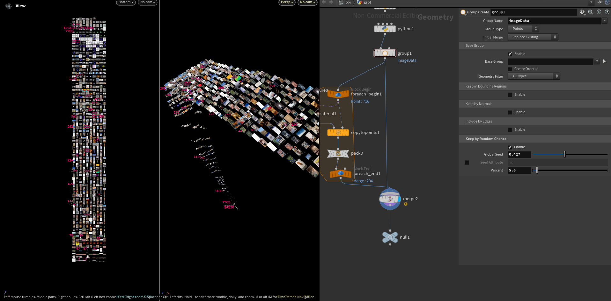

# Houdini Image Sorting

This project involves collecting image data in a JSON file and displaying it. The following screenshots demonstrate the process:

### Screenshot 1


### Screenshot 2


### Screenshot 3


### Screenshot 4


### Screenshot 5


## Code Snippets

### Part 1: Collecting Image Data

```python
from PIL import Image, ImageStat
import json
import os

# Adjusted project and image folder paths
project_folder = hou.evalParm("project_folder")
image_folder = hou.evalParm("image_folder")
sortValue = hou.evalParm("filter") # you can choose all attributes that return an int or float

# Initialize images list
images = []

# Function definitions
def getName(image):
    return os.path.basename(image)

def getExtension(image):
    return os.path.splitext(image)[1]

def getDirectory(path, image):
    return os.path.join(path, image)

def getLuminosity(image):
    im = Image.open(image).convert('L')
    stat = ImageStat.Stat(im)
    return stat.mean[0]

def getResolution(image):
    im = Image.open(image)
    return im.size

def getScale(height, width):
    scaleZ = 1 if height / width > 1 else height / width
    scaleX = width / height if height / width > 1 else 1
    return scaleX, scaleZ

def getImageSize(image):
    return os.path.getsize(image) / 1024  # Size in KB

# Check if folder exists
if os.path.exists(image_folder):
    for item in os.listdir(image_folder):
        if item.endswith((".png", ".JPG", ".jpeg", ".jpg", ".tif", ".gif")):
            image_path = os.path.join(image_folder, item)

            name = getName(image_path)
            extension = getExtension(image_path)
            directory = getDirectory(image_folder, item)
            luminosity = getLuminosity(image_path)
            width, height = getResolution(image_path)
            scaleX, scaleZ = getScale(height, width)
            size_kb = getImageSize(image_path)

            imageData = {
                'name': name,
                'extension': extension,
                'directory': directory,
                'luminosity': luminosity,
                'height': height,
                'width': width,
                'scaleX': scaleX,
                'scaleZ': scaleZ,
                'size': size_kb
            }

            # Append imageData to images list
            images.append(imageData)

# Sort images by luminosity. height, width, filesize etc
images.sort(key=lambda x: x[sortValue])

# Convert images list to JSON and write to file
output_file = os.path.join(project_folder, "images.json")
with open(output_file, 'w') as f:
    json.dump(images, f, indent=4)

```

### Part 2: visualising the images

```python
import math
import hou
import json

node = hou.pwd()
geo = node.geometry()

# Add point attributes
geo.addAttrib(hou.attribType.Point, "name", "")
geo.addAttrib(hou.attribType.Point, "extension", "")
geo.addAttrib(hou.attribType.Point, "directory", "")
geo.addAttrib(hou.attribType.Point, "luminosity", 0.0)
geo.addAttrib(hou.attribType.Point, "height", 0)
geo.addAttrib(hou.attribType.Point, "width", 0)
geo.addAttrib(hou.attribType.Point, "pscale", hou.evalParm("pscale"))
geo.addAttrib(hou.attribType.Point, "scale",  hou.Vector3(0.0, 0.0, 0.0))
geo.addAttrib(hou.attribType.Point, "index", 0)
geo.addAttrib(hou.attribType.Point, "size", 0)

# Path to the JSON file
json_file_path = "C:/Users/joris/Desktop/image_sort/images.json"
divider =  hou.evalParm('divider')
sortValue = hou.evalParm("filter") # you can choose all attributes that return an int or float
y_distance = hou.evalParm("y_distance")

try:
    # Open JSON file
    with open(json_file_path, 'r') as f:
        images = json.load(f)

        # Loop over imageData
        for index, imageData in enumerate(images):
            x = index % divider
            z = math.floor(index / divider)

            # Add point
            point = geo.createPoint()
            point.setPosition(hou.Vector3(x, imageData[sortValue] * y_distance, z))

            # Set point attributes
            point.setAttribValue("name", imageData["name"])
            point.setAttribValue("extension", imageData["extension"])
            point.setAttribValue("directory", imageData["directory"])
            point.setAttribValue("luminosity", imageData["luminosity"])
            point.setAttribValue("height", imageData["height"])
            point.setAttribValue("width", imageData["width"])
            scaleX = float(imageData["scaleX"])
            scaleZ = float(imageData["scaleZ"])
            point.setAttribValue("scale", hou.Vector3(scaleX, 1.0, scaleZ))

            point.setAttribValue("size", int(imageData["size"]))
            point.setAttribValue("index", index)

except Exception as e:
    hou.ui.displayMessage(str(e), severity=hou.severityType.Error)

```

